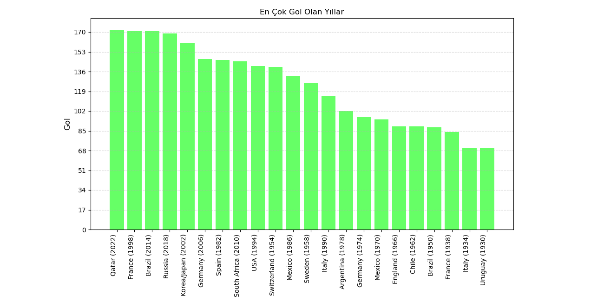

# FIFA Dünya Kupası Analizi
-1930'dan 2022'ye kadar düzenlenen tüm FIFA dünya kupası etkinliklerinin veri analizi ve görselleştirilmesi
-Pyton kullanarak ve Numpy,Pandas,Matplotlib frameworklerinden yararlanarak oluşturulmuştur

## Frameworkler Ne İçin Kullanıldı
-Numpy -> Y eksenindeki sayıların max,min noktalarını ve artış miktarını ayarlamak için kullanılmıştır 
-Pandas -> Verileri analiz etmek için kullanılmıştır
-Matplotlib -> Grafikleri Oluşturmak için kullanılmıştır

## Analiz Sonrası Oluşturulan Grafikler
-Şampiyonluk Sayıları
-İkincilik Sayıları
-Üçüncülük Sayıları
-Dördüncülük Sayıları
-İlk Dörtte Bulunma Sayıları(En az yarı finale kalma)
-En Çok Gol Atılan Turnuvalar
-Maç Başına En Çok Gol Atılan Turnuvalar
-Stadyumlarda En Çok Seyirci Olan Yıllar

## Görsel

